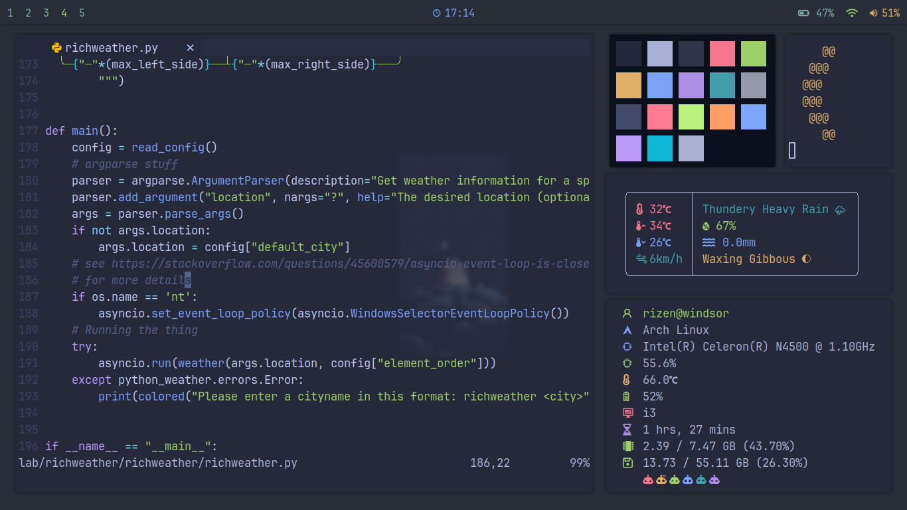

<div align="center">
<h1>Rice</h1>

> All of my dotfiles, wallpapers etc with some tips. (Arch gruvobx themed rice with i3wm)

</div>

### Wallpapers:
https://github.com/dharmx/walls/
Current one: https://github.com/dharmx/walls/blob/main/fauna/a_white_dog_with_fruits_on_it.png

### Alacritty themes credit:
https://github.com/alacritty/alacritty-theme


### Favourite oh-my-zsh themes:
(Starred and italicized is the one I currenty use)
 - bureau -> Formalish
 - amuse -> Simple and elegant
 - darkblood -> Hackerish
 - eastwood -> super clean
 - \[\*] intheloop -> *Clean, techno and cool*
 - agnoster -> aesthetic and techno

### For me:
Don't forget [Orca](https://github.com/Rizen54/Orca)

### Important notes:
 - Download code-features from AUR in case of python extension activation failure.
 - ```
   sh -c 'curl -fLo "${XDG_DATA_HOME:-$HOME/.local/share}"/nvim/site/autoload/plug.vim --create-dirs \
       https://raw.githubusercontent.com/junegunn/vim-plug/master/plug.vim'
   ```
   To install plug for nvim
- Don't forget to `chmod +x .config/polybar/launch.sh`

